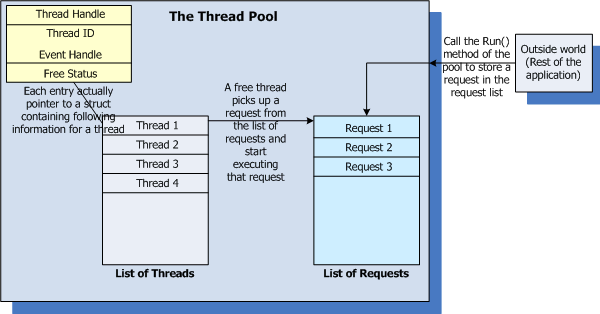

##### Win32 Thread Pool
by  [Siddharth R Barman](https://www.codeproject.com/Articles/11976/Win32-Thread-Pool)

An implementation of a Thread Pool in C++ for Windows

Once the pool is created, the following things have already happened:

- 1.The specified number of threads have been created.
- 2.These threads have been added to an internal list of threads.
- 3.A list has been created which will store the user requests for execution.
- 4.All the threads are waiting eagerly for someone to add a work item for execution.